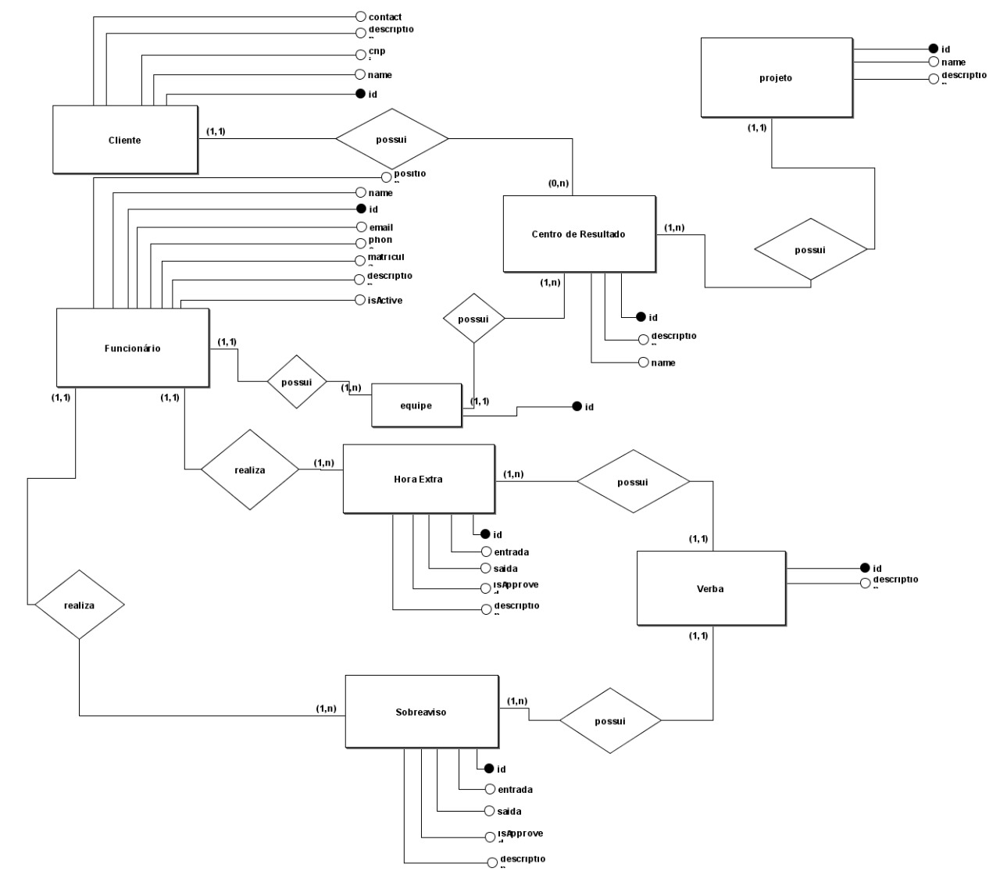
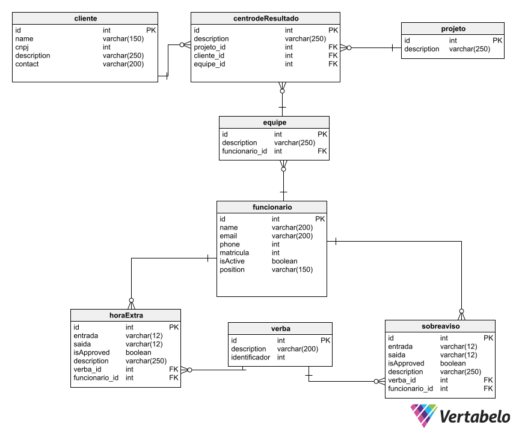

# Sistema de Gerenciamento de Horas Extras e Sobreavisos

# 🎓 Team
**Scrum Master/Developer:** Ana Christina Ferreira Dias da Silva  
**Product Owner/Developer:** Daniela dos Santos Meirelles  
**Front End Developer:** Lucas Rodrigo Leite Fonseca Moreira  
**Back End Developer:** João Victor Marinho de Souza  
 
# 📦 Repositórios integrantes do projeto

| Repositório                                                       | Descrição                                                                          |
| ----------------------------------------------------------------- | ---------------------------------------------------------------------------------- |
| [Documentation](https://github.com/2rp-net-API/2rp-net-API) | Documentação do sistema                                                      |
| [client](https://github.com/2rp-net-API/client)           | Aplicação Client com a interface dos Funcionários                                       |
| [server](https://github.com/2rp-net-API/client)           | Aplicação Server que gerencia todas as requisições e comunicação com o banco de dados |

# 🧰 Tecnologias
**Server:** Node.js  
**Client:** React e Bootstrap 
**Banco:** PostgreSQL   

# 📆 Sprints
| Sprint                                                              | Data de Entrega |
| ------------------------------------------------------------------- | --------------- |
| Sprint 1 | 18 set 2022     |
| Sprint 2 | 09 out 2022     |
| Sprint 3 | 06 nov 2022     |
| Sprint 4 | 27 nov 2022     |

# 🏁 Desafio
Sistema que faça o controle da jornada de trabalho do colaborador, identifique e classifique horas extras, 
controle das horas extras e sobreavisos, integração para consumo de dados dos colaboradores com o 
ADP, integração com o login e extração padronizada das horas executadas.
 

# ℹ️ Escopo do Produto
 O sistema permite o gerenciamento de horas extra e sobreaviso dos funcionários da empresa 2RP. 

# 🧑‍🤝‍🧑 Atores
**Funcionário:** Poderá cadastrar hora extra e sobre aviso, verificar horas extras e sobreavisos já cadastrados.   
**Gestor:** Aprovar ou negar horas extras ou sobreavisos cadastrados pelos funcionários  
**Administrador:** Administrador geral do sistema e usuários.  

## 💻 Modelagem do Banco de Dados

[Documentação do Banco de Dados](https://github.com/2rp-net-API/2rp-net-API/blob/main/documentacaoDB.pdf)

<button onclick="window.open('/documentacaoDB.pdf')">Download</button>

Modelo Conceitual

Modelo Lógico

# ✏️ Protótipo do sistema

Tela Login

Tela Hora Extra

Tela Gestor

# 📃 Entregas - Backlog

[Product Backlog](https://github.com/2rp-net-API/2rp-net-API/blob/main/Product%20Backlog.pdf)

[Sprint Backlog](https://github.com/2rp-net-API/2rp-net-API/blob/main/Sprint%20Backlog%20Total.pdf)
 
<!--
| Sprint 1 -  | Conclusão |
| --------------------------------------- | --------- |
| Backlog Total                                        |        |
| Wireframes        | ✔️          |
| Login integrado        |        |
| Cadastrar hora extra        |           |
| Cadastrar sobreaviso        |
| listar sobreaviso e aprovações        |           |
| Listar hora extra e aprovações        |   

-->
<!--

| Sprint 2 - Cliente consegue visualizar cardápio de produtos | Conclusão |
| ------------------------------------------------------------------- | --------------- |
| Protótipo do website ecommerce.    | ✔️ |
| Cliente - Realizar cadastro no site fornecendo email, nome completo, telefone, data de nascimento, endereço. | ✔️ |
| Cliente - Logar com email e senha no site. | ✔️ |
| Cliente - Página Home do website.    | ✔️ |
| Cliente - Página Cardápio de produtos disponíveis a pronta entrega.    | ✔️ |
| Cliente - Página Cardápio de produtos disponíveis somente sob encomenda.    | ✔️ |
| Cliente - Página de cadastro de novos clientes.    | ✔️ |
| Cliente - Página de login para clientes.    | ✔️ |

| Sprint 3 - Vendedora consegue controlar e cadastrar produtos e vendas e Cliente consegue adicionar produtos ao carrinho                              | Conclusão |
| ------------------------------------------------------------------- | --------------- |
| Vendedora - Cadastrar novos produtos de pronta-entrega. | ✔️ |
| Vendedora - Selecionar quantidade de produtos disponíveis a pronta entrega. | ✔️ |
| Vendedora - Selecionar quais produtos serão visíveis a clientes no cardápio de pronta entrega. | ✔️ |
| Vendedora - Remover produtos disponíveis. | ✔️ |
| Vendedora - Editar / excluir produtos cadastrados. | ✔️ |
| Vendedora - Página onde a vendedora visualiza / edita / exclui todos os produtos cadastrados. | ✔️ |
| Vendedora - Página onde a vendedora determina quais produtos e quantidade estão disponíveis à pronta entrega. | ✔️ |
| Vendedora - Página onde a vendedora cadastra novos produtos para pronta entrega. | ✔️ |
| Cliente - Selecionar produtos e quantidades e adicionar ao carrinho. | ✔️ |
| Cliente - Editar produtos e / ou quantidades selecionadas e / ou adicionadas ao carrinho. | ✔️ |
| Cliente - Solicitar orçamento para encomendas por email, whatsapp ou telefone. | ✔️ |
| Cliente - Página de produtos adicionados ao carrinho do cliente.    | ✔️ |
| Cliente - Página para redigir texto para email de encomenda. | ✔️ |

| Sprint 4 - Cliente consegue realizar compra e escolher formas de pagamento e Vendedora controlar status do pedido | Conclusão |
| ------------------------------------------------------------------- | --------------- |
| Vendedora - Receber notificação de pedidos de produtos pronta entrega. | ✔️ |
| Vendedora - Receber notificação de solicitação de orçamentos. | ✔️ |
| Vendedora - Página onde a vendedora visualiza e altera status dos pedidos recebidos. | ✔️ |
| Cliente - Confirmar produtos selecionados no carrinho. | ✔️ |
| Cliente - Selecionar formas de envio do produto (retirar no local ou entrega). | ✔️ |
| Cliente - Informar local de entrega do produto. | ✔️ |
| Cliente - Visualizar taxa de entrega, de acordo com endereço informado pelo cliente. | ✔️ |
| Cliente - Consegue visualizar status do pedido. | ✔️ |
| Cliente - Página para informar metodo de entrega da compra. | ✔️ |
| Cliente - Página para informar endereço de entrega. | ✔️ |
| Cliente - Página de pagamento online. | ✔️ |
| Cliente - Página para visualizar status do pedido. | ✔️ |
| Somente clientes cadastrados podem confirmar produtos do carrinho e realizar pagamentos. | ✔️ |
| Para entregas, formas de pagamento válidas são somente pelo site. | ✔️ |
| Para retiradas, pagamento somente presencial. | ✔️ |

# 🎯 Entrega - Sprint 1

## 💻 Telas do Sistema

## ⌛ Funcionamento -->
